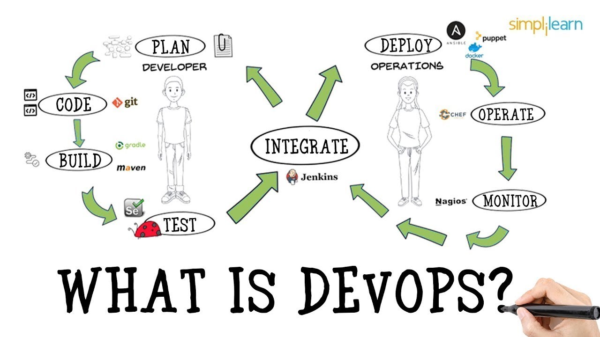
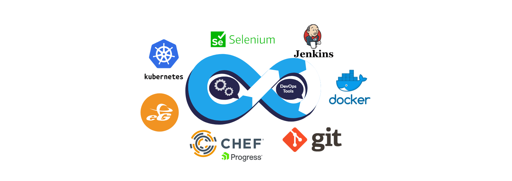

# What is DevOps

### DevOps is a combinaton of practices and tools that increased an organisation's ability to deliver applications and services faster and more effeciently.

# Benefits of DevOps

1. Faster, better product delivery
2. Faster issue resolution
3. Greater scalability
4. Stable operating environment
5. Better resource utilization
6. Greater automation
7. Greater visibility into system outcomes
8. Greater innovation

# What does the role entail

Role of a DevOps engineer includes takeaways from both agile and lean software development principles as core IT services and operations practices. As a whole, the role entails making it easier to find issues in production and build services faster. This can be achieved through:

1. Effective communication
2. Improving visibility across CI/CD pipeline
3. Consistently learning new things

# What do Devops Engineers work with

# What other teams does a DevOps Engineer interact with

A DevOps engineer works with diverse teams and departments to create and implement software systems. People who work in DevOps are experienced IT professionals who collaborate with software developers, quality assurance professionals, and IT staff to manage code releases.

# What are their common deliverables

1. Automate time-consuming and repeating tasks: DevOps engineer knows programming and is expected to deliver a fully automated process, or automate a set of manual tasks.
2. Fully tested, automated unit and integration tests: What a DevOps engineer delivers is expected to be fully tested with a high rate of code coverage for unit tests and available integration tests.
3. Continuous Integration and Deployment: Updates and future deployments should not be interrupting to the user. A DevOps engineer shouldn’t live in 2010.
4. Don’t reinvent the wheel: A DevOps engineer is expected to know enough tools and services so that he wouldn’t reinvent the wheel.
5. Software architecture is loosely coupled: When/if possible, the deliverable should be formed in decoupled micro-services communicated asynchronously rather than a tightly coupled monolith.
6. Performance/Usage metrics gathered: A DevOps engineer has to have a monitoring in place to collect enough metrics from the software to tell - at least - if the software is functioning correctly and as expected under the load.

# What is the value of a DevOps Engineers

DevOps Engineers help streamlining the SDLC within an organisation. They help deliver internal tools and products to users/clients at a faster but more efficient manner. As the role revolves around identifying problems before they become big and resolving them, devops engineers help manage organisational resources more efficiently. As a result, this can help an organisation grow and become more adaptable in an increasingly disruptive marketplace. The role also translates into greater oppurtuinties for innovation because devops engineers are required to constantly learn new technologies and tools which creates potential for an organisation to deliver industry leading products and stay ahead of the curve.

# How do DevOps engineers fit into the SDLC

DevOps engineers can be viewed as being able to see the 'bigger picture' and their roles involves interactiing across various team within SDLC essentially being involved every step of the way which further highlights their importance and magnitude of their responsibilities.

# Where can you progress from here

A successful DevOps engineer must learn to juggle between different tasks like coding, integrating, and testing. If you set out to build a career in DevOps, your career path in DevOps can see you start as a Release Manager, then move up to DevOps Test Engineer, DevOps Cloud Engineer, and finally, a DevOps Architect.

# What is Cloud Computing

Cloud computing is on-demand access, via the internet, to computing resources—applications, servers (physical servers and virtual servers), data storage, development tools, networking capabilities, and more—hosted at a remote data center managed by a cloud services provider (or CSP). The CSP makes these resources available for a monthly subscription fee or bills them according to usage.

# Who is using DevOps

1. Amazon
2. Netflix
3. NASA
4. Sony
